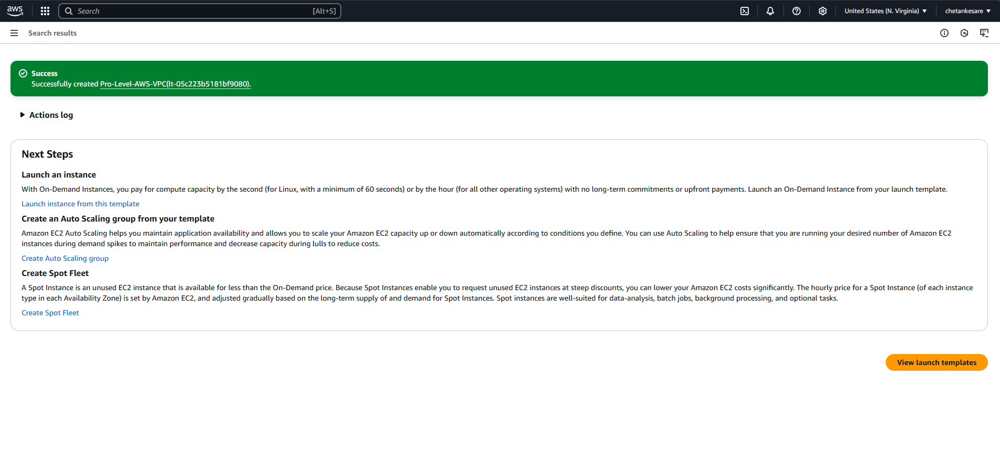
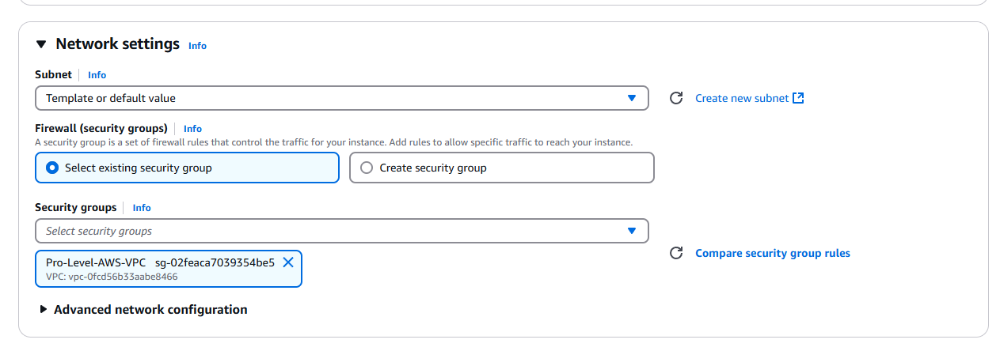

# AWS VPC with Auto Scaling, Application Load Balancer, and NAT Gateway

## About the Project

This project demonstrates how to create a VPC that you use for servers in a production environment. To improve resiliency, you deploy the servers in two Availability Zones, by using an Auto Scaling group and an Application Load Balancer. For additional security, you deploy the servers in private subnets. The servers receive requests through the load balancer. The servers can connect to the internet by using a NAT gateway. To improve resiliency, you deploy the NAT gateway in both Availability Zones.

---

## Architecture Diagram

---

## Steps to Create the Infrastructure

### 1. **Create a VPC with Subnets, Internet Gateway, and Route Tables**
1. Go to the **VPC Dashboard** in the AWS Management Console.
   
2. Click **Create VPC**.
3. Choose **VPC and more** (this option automates the creation of subnets, an internet gateway, and route tables).
   
4. Configure the VPC:
   - **Name tag auto-generation**: Enter a name prefix (e.g., `Production`).
   - **IPv4 CIDR block**: Use the default `10.0.0.0/16` or specify your own.
   - **Number of Availability Zones**: Choose **2**.
   - **Number of public subnets**: Choose **2** (these will be used for the NAT gateways and ALB).
   - **Number of private subnets**: Choose **2** (these will host your servers).
   - **NAT gateways**: Select **1 per AZ** for high availability.
   - **VPC endpoints**: Leave as default (or configure if needed).
   - **DNS options**: Enable DNS hostnames and DNS resolution.
5. Click **Create VPC**.
   
   - AWS will automatically create:
     - A VPC.
     - Public and private subnets in two Availability Zones.
     - An internet gateway.
     - Route tables for public and private subnets.
     - NAT gateways in the public subnets.
    

---

### 2. **Create an Application Load Balancer (ALB)**
1. Go to the **EC2 Dashboard** and select **Load Balancers**.
   
2. Click **Create Load Balancer** and choose **Application Load Balancer**.
   
3. Configure the ALB:
   - Select your VPC.
     
   - Add both public subnets (created automatically by the VPC wizard).
     
   - Configure security groups to allow HTTP/HTTPS traffic.
     
4. Create a target group for your servers.
   
5. Complete the setup and note the ALB’s DNS name.
   
   
   

---

### 3. **Create an Auto Scaling Group**
1. Go to the **EC2 Dashboard** and select **Auto Scaling Groups**.
   
2. Click **Create Auto Scaling Group**.
3. Configure the group:
   - Select a launch template or create a new one with your server configuration (e.g., AMI, instance type).
     
   - Choose the private subnets (created automatically by the VPC wizard).
     
   - Attach the ALB target group.
   - Set scaling policies (e.g., based on CPU utilization).
4. Complete the setup.

---

### 4. **Test the Setup**
1. Access your application using the ALB’s DNS name.
2. Verify that traffic is distributed across servers in both Availability Zones.
3. Ensure servers in private subnets can access the internet via the NAT gateways.

---

## Step-by-Step Creation Using Screenshots

Here are the screenshots for each step(I will attach all the screenshots i took in the order):

1. 
2. 
3. 
4. 
5. 
6. 
7. 
8. 
9. 
10. 
11. 
12. 
13. 
14. 
15. 
16. 
17. 
18. 
19. 
20. 
21. 
22. 
23. 
24. 
25. 
26. 
27. 
28. 
29. 

    ## Creating Bastain Host
    1. Go to EC2 Instances
    2. Click on Launch Instance
    3. Just Make the Network Changes as Following

      
31. 
32. 
    ## To Copy .pem file into the Bastian Host Use the command entered in the image
   `` scp —i "Path of the Key" "Again same Path of the key" ubuntu@ipadress_of_bastain_Host:/home/ubuntu``

---

## Notes
- The **VPC and more** option simplifies the setup by automating the creation of subnets, internet gateways, route tables, and NAT gateways.
- Ensure proper security group rules are in place to restrict access.
